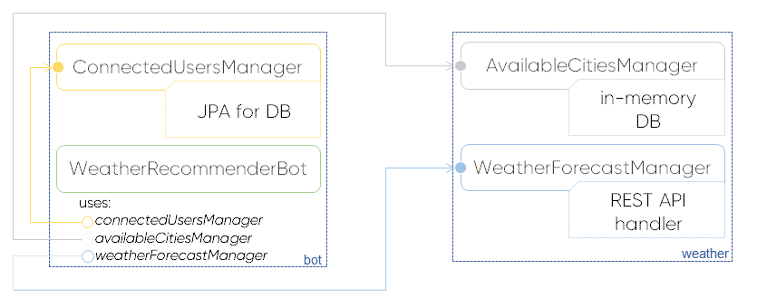
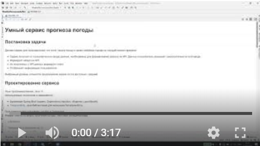

# Умный сервис прогноза погоды

## Постановка задачи
Делаем сервис для пользователей, что хотят узнать погоду в своем любимом городе на текущий момент времени:
- Сервис получает от пользователя на входе данные, необходимые для формирования запроса на API. Данные
пользователь указывает самостоятельно в поля ввода.
- Формирует запрос на API .
- Из полученных с API данных формирует ответ.
- Отображает информацию пользователю.

Выбранный уровень сложности предлагаемой задачи из 3-х доступных: средний.

## Проектирование сервиса
Язык программирования: Java 11.<br/>
Используемые технологии и зависимости:
* фреймворк Spring Boot (сервис, Dependency Injection, общение с датабазой); 
* [TelegramBots](https://github.com/rubenlagus/TelegramBots), Java-библиотекой для написания Телеграм-бота.<br/>

Пользовательский интерфейс: чат-бот в Телеграме.<br/>
Формат ответа на запрос получения погоды: текстовое сообщение вида
> {cityName}
>  
> Temperature is {temperature} °C<br/>
> Pressure is {pressure} hPa <br/>
>  Wind speed is {windSpeed} m/s <br/>

, что формируется на основе результата API-запроса к [openweathermap.org](https://openweathermap.org/)

## Принятые предпосылки
1. Основные клиенты сервиса сейчас граждане РФ. Для упрощения модели в in-memory database будем подгружать
 только города России.
2. В своей документации [openweathermap.org](https://openweathermap.org/) рекомендуют забирать прогнозы по ```cityId```
для надежности, т. к. существуют города с одинаковыми названиями. При этом нам очень не хочется усложнять интерфейс
взаимодействия пользователя с приложением. Вторая предпосылка состоит в том, что частота действий вида "выбор города"
намного меньше частоты действий вида "получение прогноза" и произвести первичный onboarding не представляется трудным.

## Архитектура


## Демонстрация
[](https://youtu.be/WAMNhHZDeNg)

## Взаимодействие пользователя с программой
Сервис - чат-бот в Телеграме, который обрабатывает команды пользователя, что с ним взаимодействует.

После получения сообщения от пользователя через интерфейс мессенджера на сервере происходит процесс его парсинга
 и вычленения команды из определенного множества
 ```shell script
  /start -- создание нового чата с ботом;
  /check -- получение текущего прогноза погоды для выбранного города;
  /find {cityName} -- поиск доступных для выбора городов с целью изменения настроек пользователя;
  /change {cityId} -- выбор другого города по его id;
  /stop -- закрытие чата с ботом и полное удаление данных с серверов приложения.
```
Если команда не найдена в множестве, пользователю отправляется ответное сообщение:
> Unknown command

Для получения данных о погоде используется открытое API сервиса [openweathermap.org](https://openweathermap.org/),
 к которому мы обращаемся на каждый запрос наших пользователей по id городов.
 
Т. к. [openweathermap.org](https://openweathermap.org/) не предоставляет API для поиска городов, а имеет сформированную 
базу, всем доступную для загрузки, то для этих целей используется in-memory датабаза, что "прогревается" на старте
приложения (см. [AvailableCitiesManager](src/main/java/com/vbutrim/weather/AvailableCitiesManager.java))
 
Для сохранения информации о пользователях, а именно о выбранных пользователями городах, используется
заранее установленная PostgreSQL-датабаза.

## Как запустить?
1. Установить [JDK 11](https://www.oracle.com/java/technologies/javase-jdk11-downloads.html) 
и [Gradle](https://gradle.org/install/)
1. Поднять PostgreSQL-датабазу (v12.1) и залить схемы таблиц<br/>
    Для этого можно воспользоваться готовым [Docker](https://www.docker.com/get-started) -образом
    ```(shell script)
    docker pull postgres:12.1
    docker run --name postgres-docker -e POSTGRES_PASSWORD=XXX -p 5432:5432 -d postgres:12.1
    ```
    Схемы используемых таблиц:
    * [1_telegram_connected_users.sql](src/main/resources/1_telegram_connected_users.sql)
1. Прописать валидные значения пропертей в [default.properties](src/main/resources/default.properties), 
а именно
    ```(shell script)
   spring.datasource.url=jdbc:postgresql://localhost:5432/postgres
   spring.datasource.username=postgres
   spring.datasource.password=password
   
   open.weather.api.key=empty
   
   telegram.bot.name=empty
   telegram.bot.token=empty
    ```
1. Собрать и запустить jar
    ```(shell script)
   ./gradlew build
   java -jar build/libs/com.vbutrim.weather-recommender-bot.jar
    ```